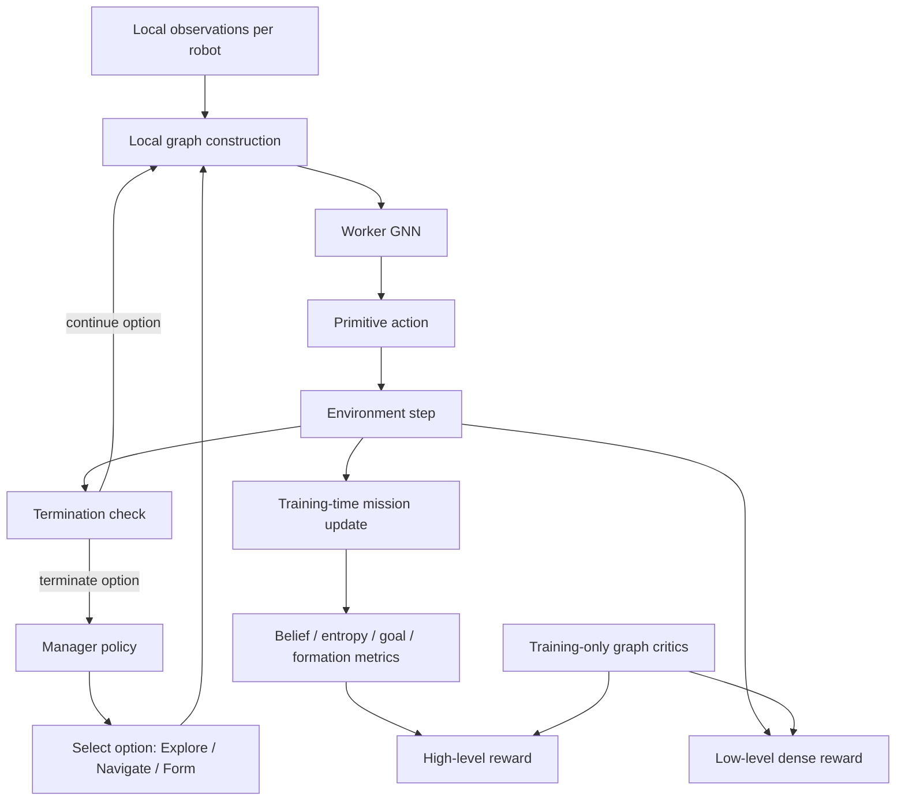
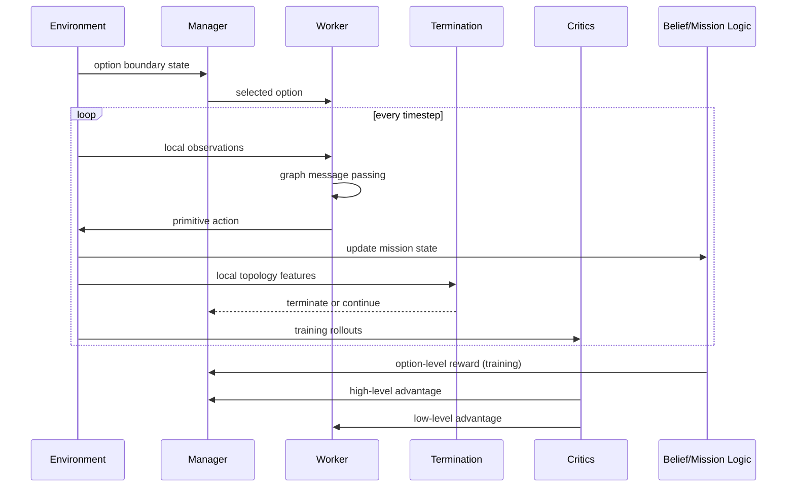

# Hierarchical Graph-Based Search and Rescue

This project implements a **fully decentralized execution framework** for multi-agent search and rescue (SAR), with **limited local communication** and **hierarchical control**.

The core idea is simple:

- a **manager** decides the current behavior mode
- a **worker** executes primitive actions at every step
- a **graph network** lets each robot coordinate only with nearby neighbors
- a **belief-based mission signal** teaches the system what good search behavior looks like during training

This design is meant to be **workable**, **scalable**, and **realistic for communication-constrained robot teams**.

---

## Problem Statement
Imagine you have a team of robots dropped into an unknown building after an earthquake. They need to find survivors. Nobody knows where the survivors are. The robots can only see a small area around themselves. They need to coordinate without a central controller telling each one what to do every second. This is a Search and Rescue (SAR) problem. This project proposes a specific mathematical framework for solving it with multiple learning agents. This defines the following set of problems:
  - Partial Observablity: each robot sees only a local part of the environment.
  - Hierarchical Problem Statement: they must spread out, share information indirectly, and later converge when a victim is likely found.
  - Decentralized Control: the number of robots can become large, so coordination must scale well.
  - Long Horizon Task: they do not know exactly where the victim is and the reward is delayed.

This work this tries to solve this problem for a Multi-Agent formulation by introduceing structure at three levels:
  - Hierarchy: a high-level policy chooses a mode/option such as explore, navigate, or form.
  - Graph reasoning: agents reason through an interaction graph instead of as isolated individuals.
  - Uncertainty reduction: the mission objective is tied to reducing uncertainty about victim location.

---

## Implementation Video

**Problem Statement**

We consider a multi-agent system operating in an initially unknown, discrete environment represented as a grid map. The environment contains randomly distributed static obstacles and an unknown number of victims. A team of homogeneous agents is deployed from one or more corner cells of the map. The agents have no prior knowledge of the environment layout, obstacle locations, or the number and positions of victims.

Each agent is capable of local sensing, limited communication, and movement to adjacent cells. The primary objective of the system is to locate and rescue all victims in the environment through coordinated exploration and collaboration.

Since the environment is unknown, agents must initially perform an exploration task to discover free space, obstacles, and victims. Victims are detectable only when agents are within a local sensing range. Upon detection, each victim reveals a requirement parameter ( k ), indicating the minimum number of agents required to complete the rescue operation.

If the number of agents currently near a detected victim is less than ( k ), the nearby agents must initiate a communication protocol to recruit additional agents. This is achieved through a distributed message-passing framework that propagates requests to other agents in the system. Agents receiving such requests must decide whether to continue exploration or navigate toward the requesting victim, based on system-level coordination policies.

Once at least ( k ) agents have gathered in the vicinity of a victim, they must form a simple spatial configuration in which each participating agent occupies a distinct cell adjacent to the victim. Upon successful formation, the victim is considered rescued and is marked as safe. The agents involved in the rescue are then released and resume exploration or assist in other rescue tasks.

The system must support concurrent operations, where multiple groups of agents may independently detect and rescue different victims. Agents that are not currently engaged in a rescue task must continue exploring the environment to discover additional victims or respond to recruitment messages.

The goal is to design distributed algorithms for exploration, communication, task allocation, and coordination that ensure all victims are eventually located and rescued efficiently, despite uncertainty in the environment and limited local information.

---

## Why this architecture exists

Search and rescue is not just path planning.

A robot team has to:
- spread out when the victim location is uncertain
- move efficiently when a likely target is found
- coordinate spatially near the target region
- do all of this **without requiring a central controller at runtime**

A flat policy usually struggles because the task mixes:
- long-horizon strategy
- local motion control
- partial observability
- coordination under sparse communication

So this project separates the problem into two levels:

- **Manager:** picks the current mode (`Explore`, `Navigate`, `Form`)
- **Worker:** decides the actual motion/action under that mode

---

## Design goals

- **Fully decentralized execution**
- **Scalable to larger teams**
- **Limited communication only through local graph neighborhoods**
- **Uncertainty-aware search**
- **Clear separation between high-level planning and low-level control**

---

## High-level architecture

---

## What the graph network is doing

The graph is the key mechanism that makes the system useful under limited communication.

Each robot builds edges only to nearby robots:

- if two robots are within communication radius, they exchange features
- if they are far away, they do not communicate directly

This gives two benefits:

1. **Scalability**  
   The model does not need dense all-to-all interaction.

2. **Decentralized realism**  
   Robots only coordinate through local neighbor messages.

### What a node contains
Each robot node usually contains:
- local observation
- current option (`Explore`, `Navigate`, or `Form`)
- local motion/state features

### What an edge contains
Each edge usually contains:
- relative position
- relative distance

### Why this is valuable
The graph lets a robot infer:
- whether an area is already crowded
- whether neighbors have already covered nearby space
- whether the team is converging or spreading
- whether a bottleneck is forming

So the graph is not decoration. It is the mechanism that turns **limited local communication** into **useful coordination**.

---

## Options: what the manager decides

The manager does **not** choose a primitive action. It chooses a mode.

### 1. Explore
Use this when the victim location is still uncertain.

Behavioral goal:
- spread out
- increase coverage
- reduce uncertainty

### 2. Navigate
Use this when the system has enough confidence about a target location.

Behavioral goal:
- move efficiently toward the target region

### 3. Form
Use this near the target/rescue zone.

Behavioral goal:
- organize robots spatially around the target
- reduce congestion and improve coordinated rescue positioning

---

## Why option-conditioned potential is used

A major design choice in this project is that **different phases should not use the same reward logic**.

A single exploration-only reward is not enough, because once the target is known, the task is no longer “search”; it becomes “move there” and then “coordinate there”.

So the high-level reward is **conditioned on the selected option**.

### Explore potential
Uses **Shannon entropy** of the victim belief map.

Why entropy?
- it directly measures uncertainty
- it is highest when belief is diffuse
- it decreases when the team gains useful information

So exploration quality is measured by **entropy reduction**.

### Navigate potential
Uses **distance-to-goal reduction**.

Why?
- once a likely target exists, progress should mean moving toward it

### Form potential
Uses **formation error reduction**.

Why?
- near the rescue site, the main problem is not uncertainty anymore
- it is coordinated spatial organization

---

## Why Shannon entropy is a good choice

Entropy is used for the **Explore** option because it gives a principled measure of uncertainty.

If the belief over victim location is spread across many cells, entropy is high.

If the belief becomes concentrated around a few cells, entropy drops.

That gives a clean notion of progress:
- lower entropy = better localization
- better localization = better search performance

This is much better than rewarding random movement or raw map coverage alone.

Important clarification:
- entropy is the right potential for **search**
- it is **not** the right potential for every phase of the mission

That is exactly why the architecture uses **option-conditioned potential**.

---

## Manager vs worker

### Manager
The manager runs only at **option boundaries**.

It decides:
- should I keep exploring?
- should I switch to navigation?
- should I form around the target?

Manager input is a **high-level compressed history**, such as:
- recent local observation summary
- previous option
- local memory of what happened in the last option segment

Manager output:
- one option label

Manager reward:
- option-level potential improvement
- minus time penalty
- minus excessive switching penalty

---

### Worker
The worker runs at **every timestep**.

Worker input:
- current local observation
- local graph message from neighbors
- currently active option

Worker output:
- primitive action

Examples:
- `up`, `down`, `left`, `right`, `stay`
- or continuous motion if needed

Worker reward:
- dense step-wise reward
- shaped according to the active option
- plus shared rescue/team progress signal

This separation is important:

- **manager = what to do**
- **worker = how to do it**

---

## Why the worker must receive the option explicitly

Without the current option as input, the worker cannot know whether it should:

- spread out for exploration
- move directly toward a target
- maintain a formation

So the worker policy is conditioned on the option.

This is a required design choice, not an optional one.

---

## Belief map: what it is and what it is not

The belief map tracks:
- where the victim might be
- how uncertain the mission currently is

### During training
The belief map is used to:
- compute entropy
- define exploration progress
- generate high-level rewards

### During execution
The worker does **not** need the full global belief map.

This is intentional.

Why?
Because the final system should remain decentralized and practical.  
Instead of feeding the full belief map to every robot at runtime, the training process uses the belief map to teach policies that behave in a belief-aware way.

So the belief map acts like a **training signal**, not necessarily an execution input.

This keeps runtime requirements realistic.

---

## Critic design

The critics are only used during training.

This project uses two critics:

### High-level critic
Used at option boundaries.

Purpose:
- evaluate long-horizon strategy choices

### Low-level critic
Used every timestep.

Purpose:
- evaluate short-horizon action quality

Both can use richer centralized graph information during training.

This is allowed because the system follows:
- **centralized training**
- **decentralized execution**

---

## Termination logic

An option should not last forever, and it should not switch every step.

So termination combines three ideas:

1. **minimum duration**
2. **maximum duration**
3. **learned graph-based termination**

The learned termination network checks:
- local observation
- nearby neighbors
- local topology

This is important because switching behavior should depend on context like:
- crowding
- local saturation
- arrival near the target
- formation already achieved

---

## Semantic initiation and termination

The options are not always equally valid.

### Explore starts when
- uncertainty is high
- no strong victim hypothesis exists

### Explore ends when
- confidence becomes high enough
- entropy falls enough

### Navigate starts when
- a likely target region exists

### Navigate ends when
- robots are close enough to the goal

### Form starts when
- robots are near the rescue zone

### Form ends when
- formation quality is good enough
- rescue is complete

This prevents nonsense behaviors like trying to form before any target has been found.

---

## Training flow

---

## Recommended reward structure

### High-level reward
Use option-conditioned potential difference:

- `Explore` -> entropy reduction
- `Navigate` -> distance-to-goal reduction
- `Form` -> formation error reduction

Also include:
- time penalty
- switching penalty

### Low-level reward
Use dense option-conditioned shaping:

- `Explore` -> local coverage / information gain
- `Navigate` -> move closer to target
- `Form` -> improve local formation quality

Also include:
- shared rescue bonus
- collision penalty
- invalid move penalty

This is one of the most important fixes compared with the original report:  
the low-level reward must be explicit.

---

## Why this architecture is scalable

The framework scales because:

- communication is local, not global
- graph computation depends on neighbors, not all agents
- manager acts less frequently than worker
- critics are centralized only during training
- runtime execution stays decentralized

This makes the system a strong candidate for larger SAR teams where full communication is unrealistic.

---

## What to keep in mind during implementation

- keep the communication radius local
- explicitly include the option in worker inputs
- use two critics (high-level and low-level)
- keep belief as training logic unless runtime belief sharing is intentionally added
- use semantic option initiation and termination
- do not mix entropy-only reward with multi-phase behavior in the final design

---

## Practical summary

This project is best understood as:

- a **strategic manager** that chooses the mission phase
- a **graph-based worker** that handles local execution
- a **belief-guided training signal** that teaches useful search behavior
- a **fully decentralized runtime controller** that only needs local observations and limited neighbor communication

That is what makes the architecture both technically strong and realistic for search and rescue.
